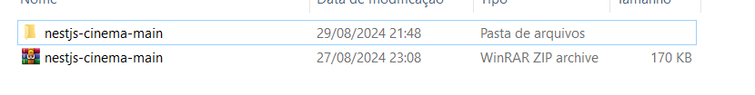
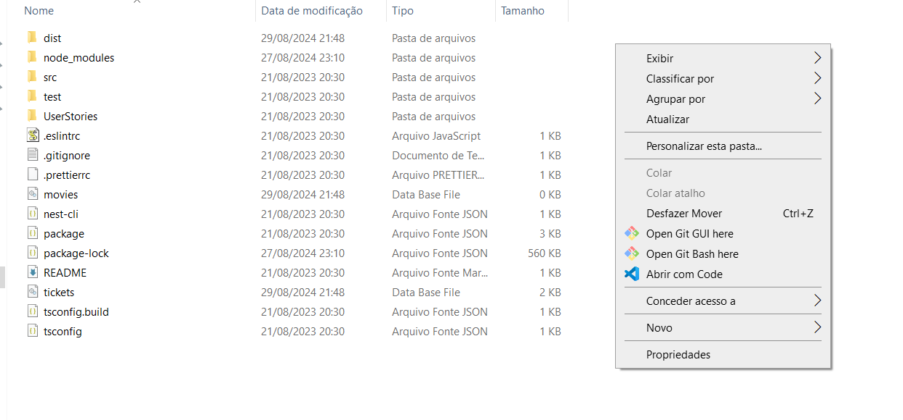

# Challenge Final do PB Compass

# Bem vindo, esse é o readme do Challenge Final(Sprint 8)

## Conteúdos abordados:

- Docker
- CI/CD com Gitlab
- Execução de testes no EC2
- Implementação do Challenge final

# O que foi feito
Nesse challenge foi usada a API de cinema para a realização dos testes. Foram feitos os planejamentos tanto funcionais quanto de performance, matriz de rastreabilidade, mapa mental , user stories, os testes funcionais e não funcionais e por fim os fluxos.

# Abaixo segue o passo de instalação sobre o que será necessário para realizar o projeto.

## Instalação(K6 e Chocolatey)

Entre no site do **[K6](https://k6.io/docs/)**,e vá para o guia de **[Instalação](https://k6.io/docs/get-started/installation/).**

Em seguida de acordo com seus SO, siga os comando que são instruidos a cada sistema.

No caso do Windows você ira, e optar pelo Chocolatey, como será feito nessa sprint, siga as instruções abaixo.

1- Entre no site da **[Chocolatey](https://chocolatey.org/install#individual)**

2- Clique na aba **INDIVIDUAL**

    


3- Copie o seguinte comando:
    ```
    Set-ExecutionPolicy Bypass -Scope Process -Force; [System.Net.ServicePointManager]::SecurityProtocol = [System.Net.ServicePointManager]::SecurityProtocol -bor 3072; iex ((New-Object System.Net.WebClient).DownloadString('https://community.chocolatey.org/install.ps1'))
    ```

4- Execute o Windows PowerShell como administrador

5- Cole o comando 

No mesmo prompt, vá para o site do **[K6](https://k6.io/docs/get-started/installation/)**.

E rode o seguinte comando: 
```
choco install k6
```

6- Importe a API Cinema pelo git clone
```
https://github.com/juniorschmitz/nestjs-cinema.git
```
7- Abra o arquivo ```netjs-cinema-main```



8- Clique em ```Open Git Bash Here```



9- Dentro do Git Bash rodar:
```
npm install
```

10 - Para rodar a aplicação, executar o comando:
```
npm run start
```

11- Para importar o meus códigos e usa-los no seu computador
 - Você pode tanto clonar:
```
	git clone https://github.com/KaueRuchinski/ChallengeFinalPB.git
```
- Ou apenas baixar o arquivo em ZIP e extrai-lo

  No intervalo disso tudo, abra o prompt de comando(como Adm de preferencia)
  e rode o seguinte codigo
  ```
  	npx serverest@latest
    ```
  Dessa forma, voce irá rodar a API que iremos usar, localmente na sua máquina
  
  1- Vá até a pasta onde está o arquivo

  2- Clique com o botão direito

  3- Selecione a opção abri com VScode ou a IDE de sua preferencia
  
  

  ##  Ao entrar na IDE e desejar rodar algum teste siga esses passos:
 
  1- Clique com botao direito no arquivo.
  
  2- Vá em Open Terminal.

  3- Clique na opção "Open in Integrated Terminal"
  
  


  11. Escreva no terminal.
   ```   	
     k6 run
    ```
  12.Em seguida você digitará o nome do arquivo que deseja testar, ou pode apertar a tecla TAB até o arquivo desejado apareça

  13. Agora só apertar ENTER e rodar o teste
      
## Objetivos dos Testes:

Avaliar o nivel de performance da API,se está funcionando de forma correta e estavel.

### Segue os links para o Mapa mental, Planejamentos e para o Jira:


- **[Mapa mental]()**

- **[User Stories Movies](https://github.com/KaueRuchinski/ChallengeFinalPB/blob/37e4f4e34b0108240c7a74003f80950063c66255/userStories/gerenciamentoDeFilmes.md)**

- **[User Stories Tickets](https://github.com/KaueRuchinski/ChallengeFinalPB/blob/37e4f4e34b0108240c7a74003f80950063c66255/userStories/reservaDeIngressos.md)**

- **[Planejamento Funcional](https://github.com/KaueRuchinski/ChallengeFinalPB/blob/37e4f4e34b0108240c7a74003f80950063c66255/planejamentos/planejamentoFuncional/planejFuncional.md)**

- **[CTs Movies](https://github.com/KaueRuchinski/ChallengeFinalPB/blob/37e4f4e34b0108240c7a74003f80950063c66255/planejamentos/planejamentoFuncional/ctsMovies.md)**

- **[CTS Tickets](https://github.com/KaueRuchinski/ChallengeFinalPB/blob/37e4f4e34b0108240c7a74003f80950063c66255/planejamentos/planejamentoFuncional/ctsTickets.md)**

- **[Planejamento performance Movies](https://github.com/KaueRuchinski/ChallengeFinalPB/blob/37e4f4e34b0108240c7a74003f80950063c66255/planejamentos/planejamentoDePerformance/planejPerMovies.md)**

- **[Planejamento performance Tickets](https://github.com/KaueRuchinski/ChallengeFinalPB/blob/37e4f4e34b0108240c7a74003f80950063c66255/planejamentos/planejamentoDePerformance/planejPerTickets.md)**


### Agradecimentos:

Enzo Rossi,Leticia Ribeiro, Mathias , Jorge, Gabriel Just, Oliver

### Autor

    Kauê Humenhuk Ruchinski

### Ajuda

Foram usadas como uma forma de ajuda e de correção o Chatgpt

## Obrigado por esses meses de PB e todo carinho

<a href="https://imgbb.com/"></a>
